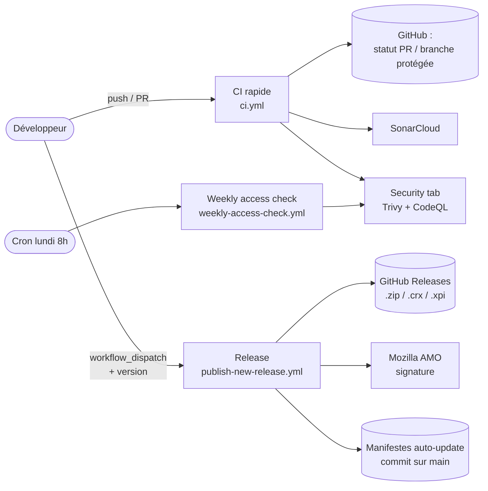
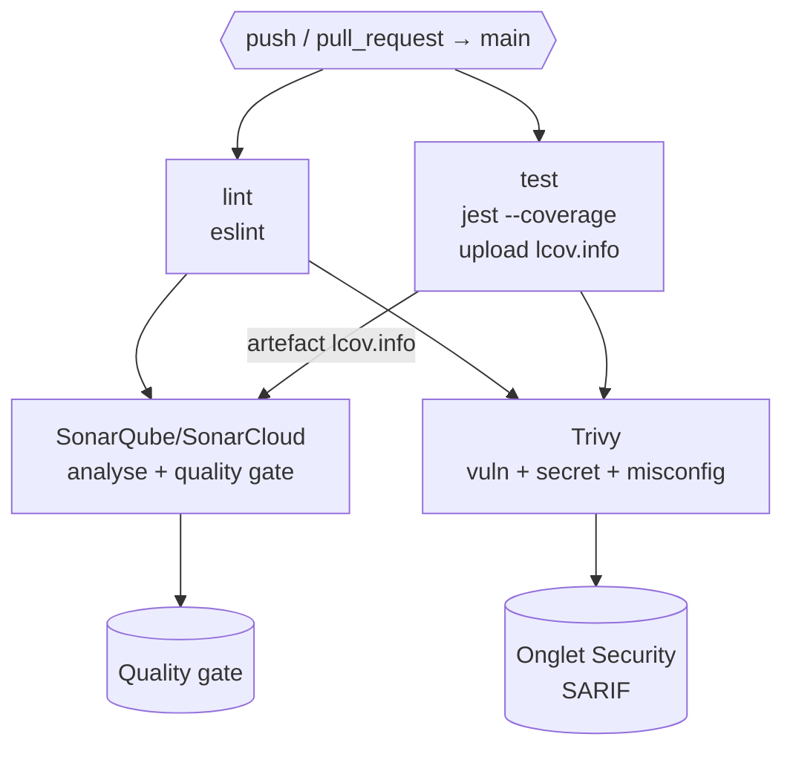
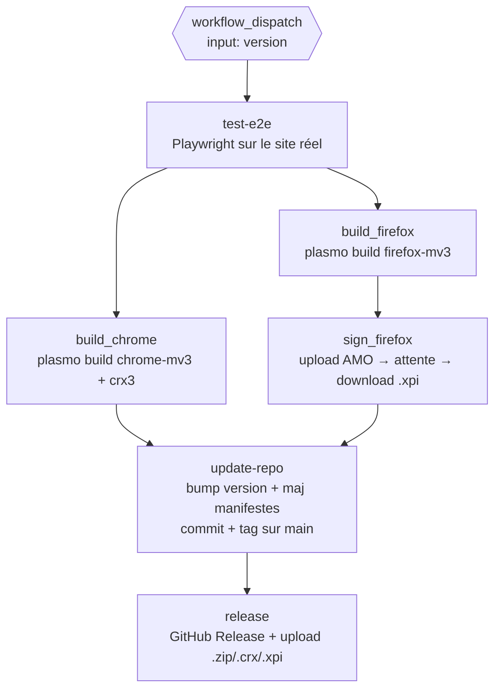
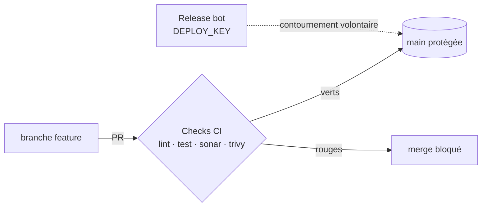

# Documentation CI/CD — 7speaking bot rework

> Extension de navigateur (Chrome / Firefox / Chromium) qui automatise l'apprentissage sur [7speaking.com](https://7speaking.com) : complétion automatique des quiz, ouverture/attente sur les leçons, overlay de pilotage et statistiques.

Cette page documente le **projet et sa chaîne CI/CD**. Pour l'installation et le démarrage rapide, voir le [README](./README.md).

---

## Sommaire

- [1. Présentation du projet](#1-présentation-du-projet)
- [2. Analyse CI/CD — qu'est-ce qui a du sens d'automatiser ?](#2-analyse-cicd--quest-ce-qui-a-du-sens-dautomatiser-)
- [3. Schéma d'architecture du pipeline](#3-schéma-darchitecture-du-pipeline)
- [4. Détail des workflows](#4-détail-des-workflows)
- [5. Tests & couverture](#5-tests--couverture)
- [6. Qualité & sécurité du code](#6-qualité--sécurité-du-code)
- [7. Gestion du code & garde-fous](#7-gestion-du-code--garde-fous)
- [8. Gestion des secrets](#8-gestion-des-secrets)
- [9. Choix non retenus (et pourquoi)](#9-choix-non-retenus-et-pourquoi)
- [10. Structure du dépôt](#10-structure-du-dépôt)

---

## 1. Présentation du projet

| Aspect | Détail |
|---|---|
| **Type** | Extension de navigateur (Manifest V3) |
| **Framework** | [Plasmo](https://www.plasmo.com/) (build d'extension multi-cibles) |
| **Langage** | TypeScript + React 19 |
| **UI** | React + TailwindCSS (overlay injecté + popup) |
| **Cibles** | Chrome / Edge / Brave (MV3), Firefox (MV3), Chromium (Opera / Vivaldi / Yandex via `.crx`) |
| **Artefacts produits** | `.zip` (Chrome), `.crx` (Chromium), `.xpi` signé (Firefox) |
| **Distribution** | GitHub Releases + auto-update via `chrome_update.xml` / `firefox_update.json` |

L'extension injecte un *content script* sur `user.7speaking.com`, communique avec le *main world* de la page pour piloter les quiz, et expose un overlay + une popup de statistiques.

---

## 2. Analyse CI/CD — qu'est-ce qui a du sens d'automatiser ?

> Le projet n'est **pas un service serveur** : c'est une extension qui tourne **dans le navigateur de l'utilisateur**. Cette contrainte dicte tous les choix ci-dessous.

| Question | Réponse pour CE projet | Conséquence sur le pipeline |
|---|---|---|
| **Y a-t-il des tests ?** | Oui : tests unitaires (Jest + jsdom) sur la logique métier, et tests e2e (Playwright) qui se connectent réellement au site cible. | CI = lint + tests unitaires + couverture ; les tests e2e (lents, dépendants du réseau et d'un compte réel) sont isolés dans le workflow de release. |
| **Y a-t-il un build à produire ?** | Oui : un bundle d'extension **par navigateur** (pas une image Docker). | Le build est multi-cibles (`plasmo build --target=...`) et déclenché à la release, pas à chaque push. |
| **Où tourne le projet ?** | Dans le navigateur de l'utilisateur final. Pas de cloud, pas de k8s, pas de VPS. | **Aucun déploiement serveur** : le « déploiement » = publier des artefacts signés sur GitHub Releases + servir les manifestes d'auto-update. |
| **Risques si on déploie du code cassé ?** | Élevés : l'auto-update pousse l'extension cassée à **tous les utilisateurs** automatiquement. | Une release ne part **que** si les tests e2e passent (`needs: test-e2e`), et la signature Firefox passe par AMO. |
| **Quels outils du cours sont réellement utiles ?** | Lint, tests + couverture, SonarCloud, Trivy, CodeQL, commits conventionnels, protection de branche, release automatisée multi-artefacts. | Voir sections 4 à 7. Les outils non pertinents (Docker, Terraform, k8s, Prometheus) sont écartés et justifiés en [section 9](#9-choix-non-retenus-et-pourquoi). |

**Stratégie retenue : deux pipelines séparés.**
- Un pipeline **CI rapide** sur chaque push/PR (`ci.yml`) → feedback en ~2 min, garde `main` propre.
- Un pipeline **release lourd et manuel** (`publish-new-release.yml`) → build + signature + publication, déclenché volontairement, jamais par accident.

---

## 3. Schéma d'architecture du pipeline

### Vue d'ensemble



### Pipeline CI (`ci.yml`) — sur chaque push / PR vers `main`



*`sonarqube` et `trivy` ont tous deux `needs: [lint, test]` : on ne lance l'analyse coûteuse que si le code lint et passe les tests.*

### Pipeline Release (`publish-new-release.yml`) — manuel (`workflow_dispatch`)



*La release est **séquencée par les dépendances** (`needs`) : rien n'est publié tant que les e2e, les builds et la signature ne sont pas tous verts.*

---

## 4. Détail des workflows

### `ci.yml` — Intégration continue

| Job | Déclencheur / `needs` | Rôle | Sortie |
|---|---|---|---|
| `lint` | push/PR `main` | ESLint sur tout le code | statut de check |
| `test` | push/PR `main` | Jest + `--coverage`, cache `.har` | artefact `coverage_info` (`lcov.info`) |
| `sonarqube` | `needs: [lint, test]` | Analyse SonarCloud + quality gate (récupère le `lcov.info`) | rapport SonarCloud |
| `trivy` | `needs: [lint, test]` | Scan `vuln,secret,misconfig` (CRITICAL/HIGH) | SARIF → onglet Security |

### `publish-new-release.yml` — Livraison continue (manuel)

| Job | `needs` | Rôle | Artefacts |
|---|---|---|---|
| `test-e2e` | — | Tests Playwright sur le site réel (compte de test) | — (gate bloquant) |
| `build_chrome` | `test-e2e` | Build MV3 Chrome + packaging `crx3` (signé `CRX_KEY`) | `.zip`, `.crx`, `chrome_update.xml` |
| `build_firefox` | `test-e2e` | Build MV3 Firefox non signé | `.zip` non signé |
| `sign_firefox` | `build_firefox` | Upload AMO → attente signature → download `.xpi` | `.xpi` signé |
| `update-repo` | `build_chrome`, `sign_firefox` | Bump `package.json`, maj `firefox_update.json`, commit + tag sur `main` (via `DEPLOY_KEY`) | commit + tag |
| `release` | `update-repo` | Crée la GitHub Release et y attache les 3 artefacts | Release publique |

### `weekly-access-check.yml` — Supervision légère

| Job | Déclencheur | Rôle |
|---|---|---|
| `test-e2e` | Cron `0 8 * * 1` (lundi 8h UTC) + manuel | Vérifie chaque semaine que l'extension peut toujours s'authentifier et naviguer sur 7speaking (détecte une rupture côté site avant les utilisateurs). |

> **Supervision pragmatique** : sans serveur à monitorer, le vrai risque est que **le site cible change** et casse l'extension. Ce cron joue le rôle d'alerte (échec e2e visible dans Actions) là où un Prometheus/Grafana n'aurait rien à observer.

---

## 5. Tests & couverture

| Niveau | Outil | Emplacement | Lancé dans |
|---|---|---|---|
| Unitaire | Jest + `ts-jest` + jsdom | `tests/unit/**` | `ci.yml` (chaque push/PR) |
| End-to-end | Playwright (Chromium) | `tests/e2e/**` | `publish-new-release.yml` + cron hebdo |

**Couverture** : mesurée à chaque CI via `jest --coverage`, l'artefact `lcov.info` est publié puis **consommé par SonarCloud**, qui porte le **quality gate**.

> **Choix assumé** : pas de `coverageThreshold` dur dans `jest.config.js`. Le seuil de qualité est centralisé dans SonarCloud (quality gate), pour éviter **deux garde-fous redondants** qui dérivent l'un de l'autre. La couverture reste donc mesurée et visible — son blocage est délégué à Sonar.

```bash
yarn test            # tests unitaires
yarn test --coverage # + rapport de couverture (coverage/lcov.info)
yarn test:e2e        # build dev puis tests Playwright (nécessite un compte de test)
```

---

## 6. Qualité & sécurité du code

| Outil | Quoi | Où c'est visible |
|---|---|---|
| **ESLint** | Qualité/style du code TS/React | Job `lint` |
| **Prettier** | Formatage (+ tri d'imports) | Local / `.prettierrc.mjs` |
| **SonarCloud** | Bugs, code smells, couverture, quality gate | Job `sonarqube` → dashboard SonarCloud |
| **Trivy** | Vulnérabilités dépendances, secrets, misconfig | Job `trivy` → onglet Security (SARIF) |
| **CodeQL** | Analyse statique de sécurité (setup GitHub par défaut) | Workflow CodeQL → onglet Security |

**Bonne pratique appliquée** : toutes les actions tierces sont **épinglées par SHA** (ex. `borales/actions-yarn@3766bb1...`, `aquasecurity/trivy-action@ed142fd...`) — pas de tag mutable `@v3` qui pourrait être déplacé vers du code malveillant.

---

## 7. Gestion du code & garde-fous

| Mécanisme | Mise en œuvre |
|---|---|
| **Workflow Git** | GitHub Flow : branches de feature → PR → merge sur `main`. |
| **Protection de branche** | `main` est protégée : merge via PR + checks CI requis, pas de push direct. |
| **Commits conventionnels** | `commitlint` + `@commitlint/config-conventional` (`commitlint.config.mjs`). |
| **Hook local** | Husky `commit-msg` valide chaque message de commit avant qu'il n'entre dans l'historique. |
| **Contournement maîtrisé** | Le job `update-repo` commit le bump de version + le tag **directement sur `main` malgré la protection**, via une `DEPLOY_KEY` dédiée. C'est **volontaire** : seule la release automatisée (et personne d'autre) peut écrire sur `main` sans PR. |



---

## 8. Gestion des secrets

Aucun secret n'est en clair dans le dépôt — tous via **GitHub Secrets**, injectés en variables d'environnement au moment du job.

| Secret | Utilisé par | Pour |
|---|---|---|
| `SONAR_TOKEN` | `ci.yml` (sonarqube) | Auth SonarCloud |
| `WEBSITE_TEST_USERNAME` / `_PASSWORD` | e2e (release + hebdo) | Compte de test 7speaking |
| `CRX_KEY` | `build_chrome` | Signer le `.crx` Chromium |
| `FIREFOX_API_KEY` / `_SECRET` | `sign_firefox` | Signature AMO (Mozilla) |
| `DEPLOY_KEY` | `update-repo` | Commit/tag sur `main` protégée |

`.env.exemple` documente les variables locales attendues sans jamais exposer de valeur.

---

## 9. Choix non retenus (et pourquoi)

> L'évaluation porte sur la **pertinence** : voici ce qui a été **volontairement écarté**, car non pertinent pour une extension de navigateur.

| Écarté | Pourquoi |
|---|---|
| **Docker / image conteneurisée** | L'artefact livrable est un bundle d'extension (`.crx`/`.xpi`/`.zip`), pas un service. Rien à conteneuriser. |
| **Kubernetes / minikube** | Aucun service à orchestrer : le code tourne dans le navigateur de l'utilisateur. |
| **Terraform / IaC** | Pas d'infrastructure cloud à provisionner. |
| **Environnements dev/staging/prod** | Pas de serveur ; la « prod » = les artefacts publiés en Release + l'auto-update. |
| **Prometheus / Grafana** | Rien à superviser côté serveur. Le risque réel (rupture du site cible) est couvert par le cron e2e hebdomadaire. |
| **semantic-release (release 100 % auto)** | La release est **manuelle** (`workflow_dispatch` + version), volontairement : la signature AMO et la publication aux utilisateurs ne doivent pas partir sur un simple merge. Les commits conventionnels sont tout de même en place. |

---

## 10. Structure du dépôt

```text
.
├── .github/workflows/
│   ├── ci.yml                     # CI : lint, test+coverage, sonar, trivy
│   ├── publish-new-release.yml    # Release manuelle multi-navigateurs
│   └── weekly-access-check.yml    # Cron e2e hebdo (santé du site cible)
├── src/
│   ├── contents/                  # content scripts (overlay, quiz, routes, services)
│   ├── popup/                     # popup React (stats)
│   └── types/
├── tests/
│   ├── unit/                      # Jest
│   └── e2e/                       # Playwright
├── script/                        # scripts de signature/upload Firefox (AMO)
├── release/                       # manifestes d'auto-update (chrome_update.xml, firefox_update.json)
├── jest.config.js · playwright.config.ts · eslint.config.mts
├── commitlint.config.mjs · .husky/ · sonar-project.properties
└── package.json
```
