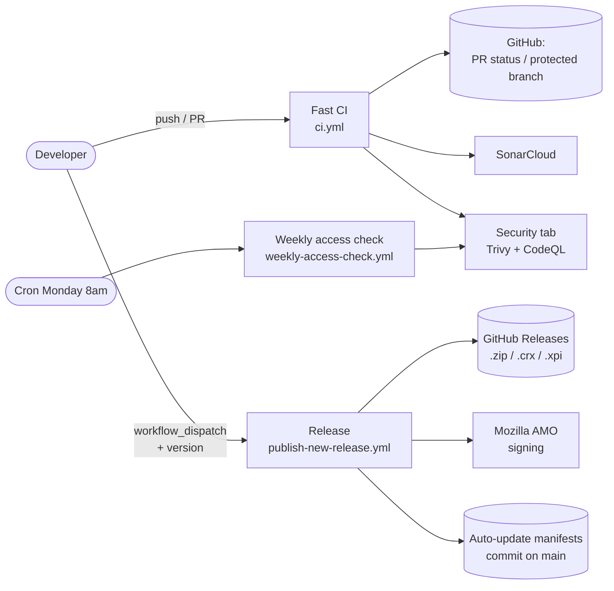
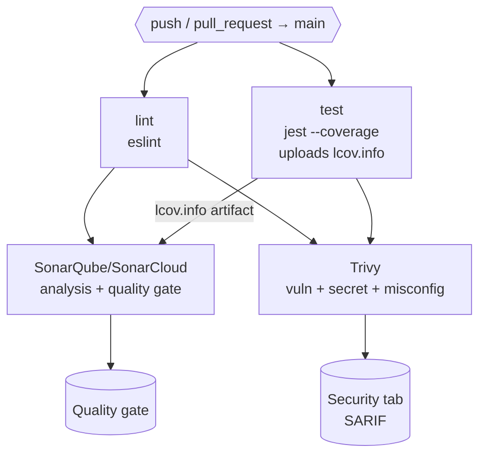
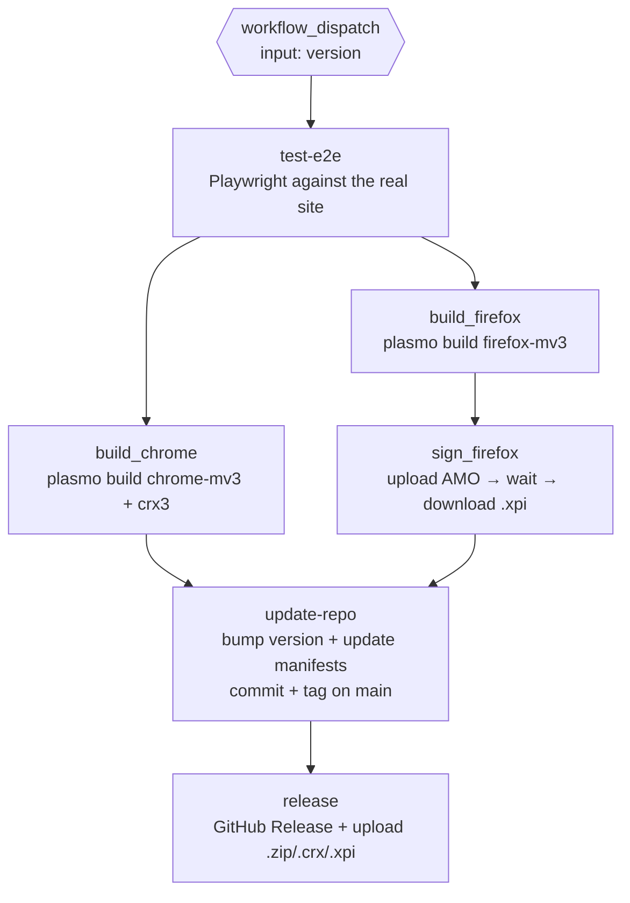
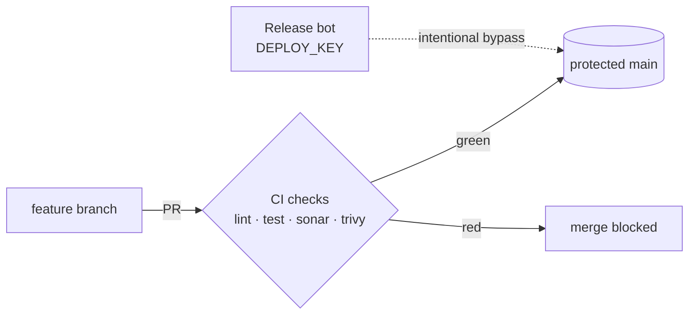

# 7speaking bot rework

> A browser extension (Chrome / Firefox / Chromium) that automates learning on [7speaking.com](https://7speaking.com): automatic quiz completion, opening and waiting on lesson pages, a control overlay, and statistics.

Inspired by [7speaking bot legacy](https://github.com/Dixel1/7speaking-bot-legacy).


---

## Table of contents

- [1. Project overview](#1-project-overview)
- [2. CI/CD analysis — what is worth automating?](#2-cicd-analysis--what-is-worth-automating)
- [3. Pipeline architecture diagram](#3-pipeline-architecture-diagram)
- [4. Workflow details](#4-workflow-details)
- [5. Tests & coverage](#5-tests--coverage)
- [6. Code quality & security](#6-code-quality--security)
- [7. Code management & guardrails](#7-code-management--guardrails)
- [8. Secret management](#8-secret-management)
- [9. What was deliberately left out (and why)](#9-what-was-deliberately-left-out-and-why)
- [10. Installation (users)](#10-installation-users)
- [11. Getting started (developers)](#11-getting-started-developers)
- [12. Repository structure](#12-repository-structure)

---

## 1. Project overview

| Aspect | Detail |
|---|---|
| **Type** | Browser extension (Manifest V3) |
| **Framework** | [Plasmo](https://www.plasmo.com/) (multi-target extension build) |
| **Language** | TypeScript + React 19 |
| **UI** | React + TailwindCSS (injected overlay + popup) |
| **Targets** | Chrome / Edge / Brave (MV3), Firefox (MV3), Chromium (Opera / Vivaldi / Yandex via `.crx`) |
| **Build artifacts** | `.zip` (Chrome), `.crx` (Chromium), signed `.xpi` (Firefox) |
| **Distribution** | GitHub Releases + auto-update via `chrome_update.xml` / `firefox_update.json` |

The extension injects a *content script* on `user.7speaking.com`, talks to the page's *main world* to drive the quizzes, and exposes an overlay plus a statistics popup.

---

## 2. CI/CD analysis — what is worth automating?

> This project is **not a server-side service**: it is an extension that runs **in the user's browser**. That constraint drives every choice below.

| Question | Answer for THIS project | Impact on the pipeline |
|---|---|---|
| **Are there tests?** | Yes: unit tests (Jest + jsdom) on the business logic, and e2e tests (Playwright) that actually connect to the target site. | CI = lint + unit tests + coverage; the e2e tests (slow, network-dependent, require a real account) are isolated in the release workflow. |
| **Is there a build to produce?** | Yes: one extension bundle **per browser** (not a Docker image). | The build is multi-target (`plasmo build --target=...`) and triggered at release time, not on every push. |
| **Where does it run?** | In the end user's browser. No cloud, no k8s, no VPS. | **No server deployment**: "deploying" = publishing signed artifacts to GitHub Releases + serving the auto-update manifests. |
| **What are the risks of shipping broken code?** | High: auto-update pushes the broken extension to **every user** automatically. | A release only goes out if the e2e tests pass (`needs: test-e2e`), and Firefox signing goes through AMO. |
| **Which course tools are actually useful?** | Lint, tests + coverage, SonarCloud, Trivy, CodeQL, conventional commits, branch protection, automated multi-artifact release. | See sections 4 to 7. Tools that are not relevant (Docker, Terraform, k8s, Prometheus) are dropped and justified in [section 9](#9-what-was-deliberately-left-out-and-why). |

**Chosen strategy: two separate pipelines.**
- A **fast CI** pipeline on every push/PR (`ci.yml`) → feedback in ~2 min, keeps `main` clean.
- A **heavy, manual release** pipeline (`publish-new-release.yml`) → build + signing + publishing, triggered on purpose, never by accident.

---

## 3. Pipeline architecture diagram

### Overview



### CI pipeline (`ci.yml`) — on every push / PR to `main`



*Both `sonarqube` and `trivy` declare `needs: [lint, test]`: the expensive analysis only runs if the code lints and the tests pass.*

### Release pipeline (`publish-new-release.yml`) — manual (`workflow_dispatch`)



*The release is **sequenced by dependencies** (`needs`): nothing is published until the e2e tests, the builds, and the signing are all green.*

---

## 4. Workflow details

### `ci.yml` — Continuous Integration

| Job | Trigger / `needs` | Role | Output |
|---|---|---|---|
| `lint` | push/PR `main` | ESLint over the whole codebase | check status |
| `test` | push/PR `main` | Jest + `--coverage`, `.har` cache | `coverage_info` artifact (`lcov.info`) |
| `sonarqube` | `needs: [lint, test]` | SonarCloud analysis + quality gate (downloads `lcov.info`) | SonarCloud report |
| `trivy` | `needs: [lint, test]` | `vuln,secret,misconfig` scan (CRITICAL/HIGH) | SARIF → Security tab |

### `publish-new-release.yml` — Continuous Delivery (manual)

| Job | `needs` | Role | Artifacts |
|---|---|---|---|
| `test-e2e` | — | Playwright tests against the real site (test account) | — (blocking gate) |
| `build_chrome` | `test-e2e` | Chrome MV3 build + `crx3` packaging (signed with `CRX_KEY`) | `.zip`, `.crx`, `chrome_update.xml` |
| `build_firefox` | `test-e2e` | Unsigned Firefox MV3 build | unsigned `.zip` |
| `sign_firefox` | `build_firefox` | Upload to AMO → wait for signing → download `.xpi` | signed `.xpi` |
| `update-repo` | `build_chrome`, `sign_firefox` | Bump `package.json`, update `firefox_update.json`, commit + tag on `main` (via `DEPLOY_KEY`) | commit + tag |
| `release` | `update-repo` | Create the GitHub Release and attach the 3 artifacts | public Release |

### `weekly-access-check.yml` — Lightweight monitoring

| Job | Trigger | Role |
|---|---|---|
| `test-e2e` | Cron `0 8 * * 1` (Monday 8am UTC) + manual | Weekly check that the extension can still authenticate and navigate on 7speaking (detects a breaking change on the site before users do). |

> **Pragmatic monitoring**: with no server to monitor, the real risk is that **the target site changes** and breaks the extension. This cron acts as the alert (e2e failure visible in Actions) where a Prometheus/Grafana stack would have nothing to observe.

---

## 5. Tests & coverage

| Level | Tool | Location | Run in |
|---|---|---|---|
| Unit | Jest + `ts-jest` + jsdom | `tests/unit/**` | `ci.yml` (every push/PR) |
| End-to-end | Playwright (Chromium) | `tests/e2e/**` | `publish-new-release.yml` + weekly cron |

**Coverage**: measured on every CI run via `jest --coverage`; the `lcov.info` artifact is uploaded and then **consumed by SonarCloud**, which holds the **quality gate**.

> **Deliberate choice**: no hard `coverageThreshold` in `jest.config.js`. The quality gate is centralized in SonarCloud, to avoid **two redundant gates** drifting apart. Coverage is still measured and visible — its enforcement is delegated to Sonar.

```bash
yarn test            # unit tests
yarn test --coverage # + coverage report (coverage/lcov.info)
yarn test:e2e        # dev build then Playwright tests (requires a test account)
```

---

## 6. Code quality & security

| Tool | What | Where it shows up |
|---|---|---|
| **ESLint** | TS/React code quality & style | `lint` job |
| **Prettier** | Formatting (+ import sorting) | local / `.prettierrc.mjs` |
| **SonarCloud** | Bugs, code smells, coverage, quality gate | `sonarqube` job → SonarCloud dashboard |
| **Trivy** | Dependency vulnerabilities, secrets, misconfig | `trivy` job → Security tab (SARIF) |
| **CodeQL** | Static security analysis (GitHub default setup) | CodeQL workflow → Security tab |

**Applied best practice**: all third-party actions are **pinned by SHA** (e.g. `borales/actions-yarn@3766bb1...`, `aquasecurity/trivy-action@ed142fd...`) — no mutable `@v3` tag that could be moved to malicious code.

---

## 7. Code management & guardrails

| Mechanism | Implementation |
|---|---|
| **Git workflow** | GitHub Flow: feature branches → PR → merge into `main`. |
| **Branch protection** | `main` is protected: merge via PR + required CI checks, no direct push. |
| **Conventional commits** | `commitlint` + `@commitlint/config-conventional` (`commitlint.config.mjs`). |
| **Local hook** | Husky `commit-msg` validates every commit message before it enters history. |
| **Controlled bypass** | The `update-repo` job commits the version bump + tag **directly to `main` despite branch protection**, via a dedicated `DEPLOY_KEY`. This is **intentional**: only the automated release (and nobody else) may write to `main` without a PR. |



---

## 8. Secret management

No secret is stored in plaintext in the repo — everything goes through **GitHub Secrets**, injected as environment variables at job time.

| Secret | Used by | For |
|---|---|---|
| `SONAR_TOKEN` | `ci.yml` (sonarqube) | SonarCloud auth |
| `WEBSITE_TEST_USERNAME` / `_PASSWORD` | e2e (release + weekly) | 7speaking test account |
| `CRX_KEY` | `build_chrome` | Sign the Chromium `.crx` |
| `FIREFOX_API_KEY` / `_SECRET` | `sign_firefox` | AMO signing (Mozilla) |
| `DEPLOY_KEY` | `update-repo` | Commit/tag on protected `main` |

`.env.exemple` documents the expected local variables without ever exposing a value.

---

## 9. What was deliberately left out (and why)

> Grading is about **relevance**: here is what was **deliberately dropped**, because it is not relevant for a browser extension.

| Dropped | Why |
|---|---|
| **Docker / container image** | The deliverable is an extension bundle (`.crx`/`.xpi`/`.zip`), not a service. Nothing to containerize. |
| **Kubernetes / minikube** | No service to orchestrate: the code runs in the user's browser. |
| **Terraform / IaC** | No cloud infrastructure to provision. |
| **dev/staging/prod environments** | No server; "prod" = the published Release artifacts + auto-update. |
| **Prometheus / Grafana** | Nothing to monitor server-side. The real risk (target site breaking) is covered by the weekly e2e cron. |
| **semantic-release (fully automated release)** | The release is **manual** (`workflow_dispatch` + version) on purpose: AMO signing and publishing to users must not fire on a simple merge. Conventional commits are still in place. |

---

## 10. Installation (users)

### Firefox
1. Download the `.xpi` from the [releases](https://github.com/orkeilius/7speaking-bot-rework/releases/).
2. Open the file with Firefox.

### Opera / Vivaldi / Yandex
1. Download the `.crx` from the [releases](https://github.com/orkeilius/7speaking-bot-rework/releases/).
2. Go to `chrome://extensions/` and enable developer mode.
3. Drag and drop the `.crx` onto the extensions page.

### Chrome / Edge / Brave (🚨 no automatic update 🚨)
1. Download the `.zip` from the [releases](https://github.com/orkeilius/7speaking-bot-rework/releases/).
2. Unzip the file.
3. Go to `chrome://extensions/` and enable developer mode.
4. Click "Load unpacked" and select the unzipped folder.

---

## 11. Getting started (developers)

```bash
yarn install
yarn run dev      # dev build + hot reload (plasmo dev)
yarn run build    # production build
yarn run lint     # eslint
yarn run test     # unit tests
```

---

## 12. Repository structure

```text
.
├── .github/workflows/
│   ├── ci.yml                     # CI: lint, test+coverage, sonar, trivy
│   ├── publish-new-release.yml    # Manual multi-browser release
│   └── weekly-access-check.yml    # Weekly e2e cron (target site health)
├── src/
│   ├── contents/                  # content scripts (overlay, quiz, routes, services)
│   ├── popup/                     # React popup (stats)
│   └── types/
├── tests/
│   ├── unit/                      # Jest
│   └── e2e/                       # Playwright
├── script/                        # Firefox signing/upload scripts (AMO)
├── release/                       # auto-update manifests (chrome_update.xml, firefox_update.json)
├── jest.config.js · playwright.config.ts · eslint.config.mts
├── commitlint.config.mjs · .husky/ · sonar-project.properties
└── package.json
```
